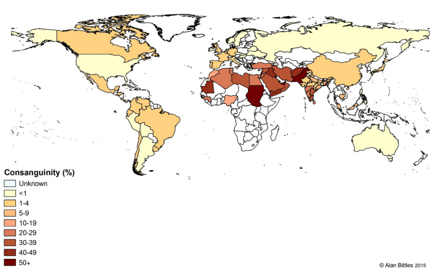

# 538-Plot-Recreation

## General Description

This project was assigned as part of our Data Science I course. 
The point of this assignment was to take a plot from an article on [538](https://fivethirtyeight.com/) and recreate it to the best of our ability.
For our plot, we chose to use the article ["How Many Americans are Married to Their Cousin?"](https://fivethirtyeight.com/features/how-many-americans-are-married-to-their-cousins/), choosing the heatmap of the world shown on that page.

The original plot we tried to recreate can be seen here: 

Our resulting plot and analysis can be seen in the Quarto document.

## Known Issues

The dataset we were given via the website had some discrepancies with the original plot provided in the article:
* Data is missing for certain countries (Russia, Mauritania)
* Data is present for countries that were not on the original plot (South Africa)
* Data for some countries in the dataset does not match the original plot (Mexico, Nigeria)
* On the original map, India is split into multiple subregions, yet these regions do not appear in the dataset and thus could not be represented.

We also displayed the data for Sudan under both South Sudan and Sudan, as they were combined in the regular dataset.
